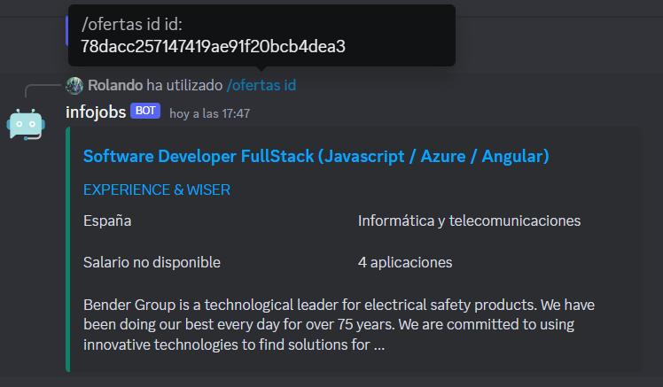
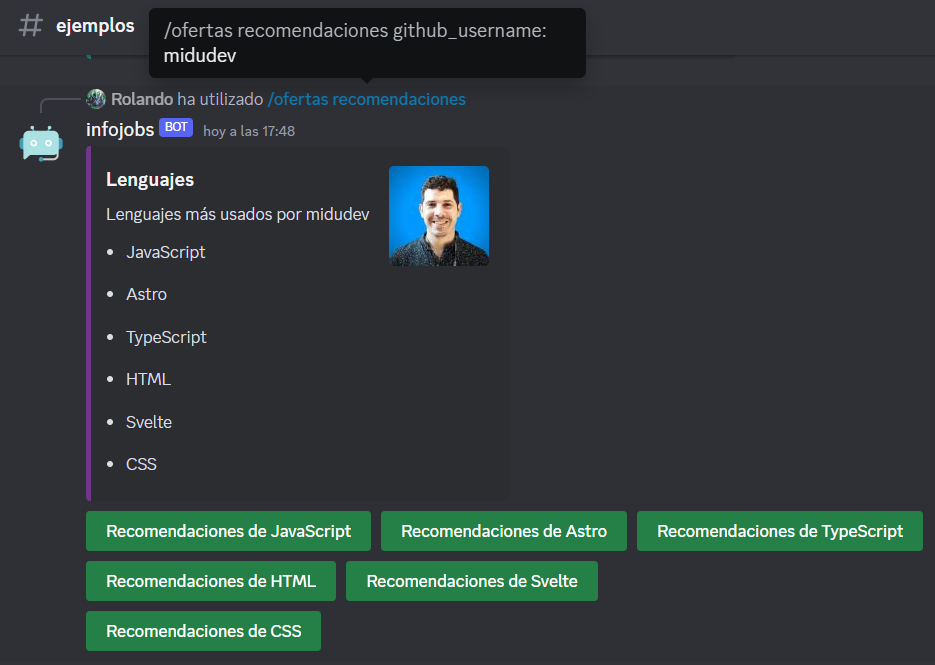
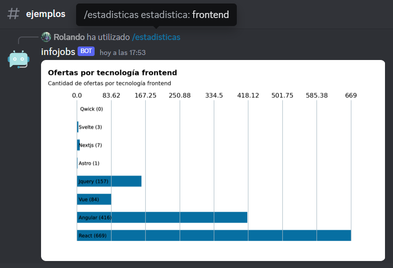

<p align="center">
    
</p>

# Infojobs Discord Bot

Este proyecto fue creada para participar en la hackaton organizada por [midudev](https://twitch.tv/midudev) junto a [Infojobs](https://infojobs.net/)

<br>

## De qué trata?
El proyecto consiste en un bot de discord al que puedes realizar consultas a través de comandos para obtener información rápidamente sobre ofertas de trabajo en infojobs.

<br>

### Con esta aplicación puedes acceder a funcionalidades como:
* Navegar entre todas las ofertas de trabajo ofrecidas.

* Consultar ofertas de trabajo por: categoria, habilidad, país y ID.

* Puedes buscar órdenes de trabajo que coincidan con lo que necesites.

* Obtén recomendaciones sobre ofertas de trabajo que se solicitan tus conocimientos a partir de tu perfil en github.

* Consultar categorías, habilidades y países.

* Puede obtener estadísticas sobre las ofertas de trabajo según lenguajes, tecnologías frontend y backend; así cómo por países y categorías

<br>

## Tecnologías
* Python
* Discord
* Redis
* Infojobs API
* Github API

<br>

## Comandos

```bash
# Muestra la lista de comandos que puedes ejecutar
/comandos

# Muestra todas ofertas de trabajo disponibles
/ofertas todas

# Muestra las ofertas de trabajo de la categoría especificada
/ofertas categorias <categoria>

# Muestra las ofertas de trabajo de la habilidad especificada
/ofertas habilidades <habilidad>

# Muestra las ofertas de trabajo del país especificado
/ofertas paises <pais>

# Busca ofertas de trabajo según palabras clave
/ofertas buscar <búsqueda>

# Consulta una oferta de trabajo específica por su ID
/ofertas id <id>

# Obtén recomendaciones de ofertas de trabajo según tu perfil en github
/ofertas recomendaciones <github-username>

# Obtén las categorías de ofertas de trabajo
/categorias

# Obtén todas las habilidades de ofertas de trabajo
/habilidades todas

# Obtén todas las habilidades asociadas a una cierta categoría
/habilidades categorias <categoria>

# Obtén los países de ofertas de trabajo
/paises

# Lenguajes de programación más usados
/estadisticas lenguajes

# Tecnologías frontend más usadas
/estadisticas frontend

# Tecnologías backend más usadas
/estadisticas backend
    
# Ofertas de trabajo por país
/estadisticas paises

# Ofertas de trabajo por categoría
/estadisticas categorias
```
 
<br>
 
## Ejemplos

```bash
/ofertas id id: 78dacc257147419ae91f20bcb4dea3
```


<br>

```bash
/ofertas recomendaciones github_username: midudev
```


<br>

```bash
/estadisticas estadistica: frontend
```


<br>

## Ejecutándolo

### Es necesario tener una cuenta de Cloudinary e ingresar las siguientes variables en un archivo de variables de entorno:
```env
DISCORD_BOT_TOKEN
REDIS_HOST
REDIS_PORT
REDIS_PASSWORD
INFOJOBS_TOKEN
GITHUB_TOKEN
```

### Descargas el proyecto de github
```bash
git clone https://github.com/Rolando1010/Impage
```

### Desde una terminal ingresas a la raíz del proyecto, instalas las dependencias y ejecutas el proyecto
```bash
cd Infojobs-Discord-Bot
pip install -r requirements.txt
cd src
python run_discord_bot.py
```